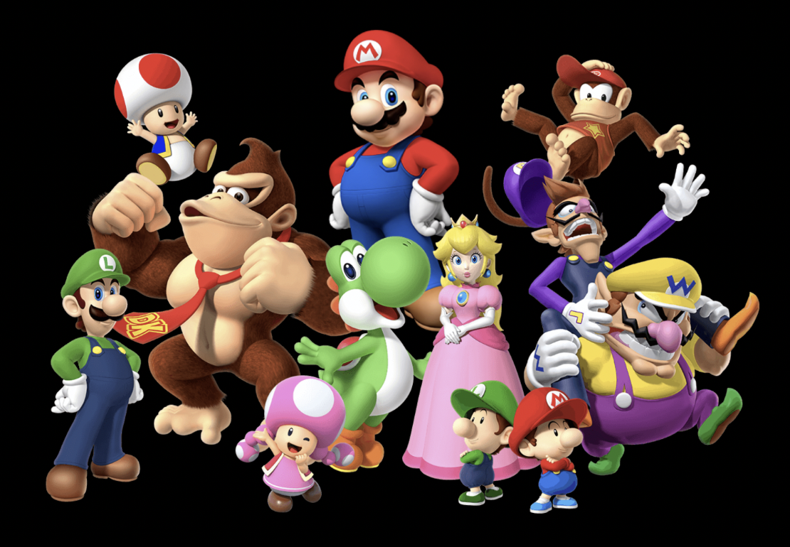
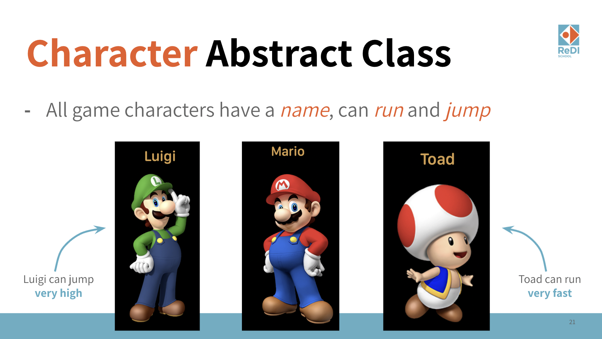
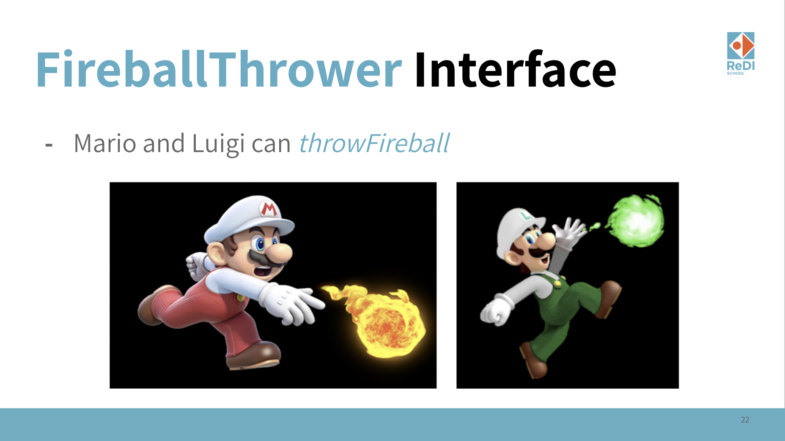
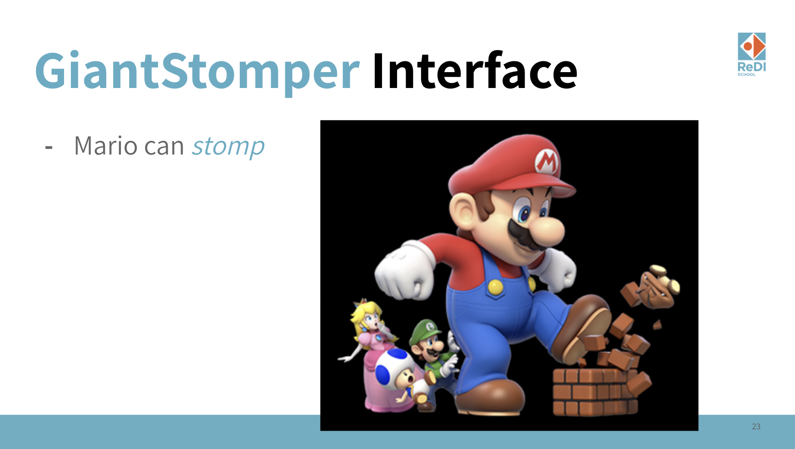

# [OOP 4 - Abstract Classes and Interfaces](https://redi-school.github.io/intermediate-java/oop-4-abstract-classes-and-interfaces/)

## Description

Let's implement a Super Mario game :)

  
### Step 1 - Characters

    
### Step 2 - Fireballs

### Step 3 - Giant Mario

